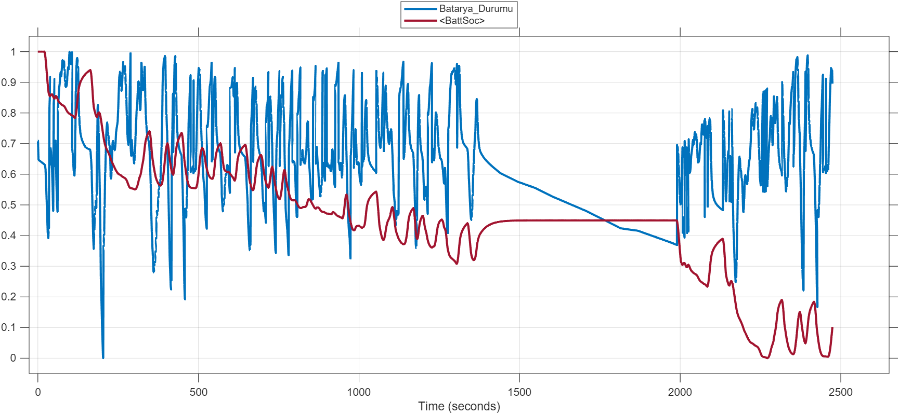
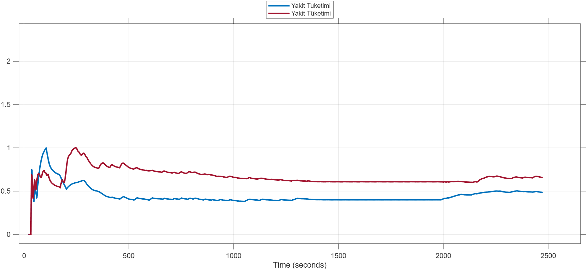
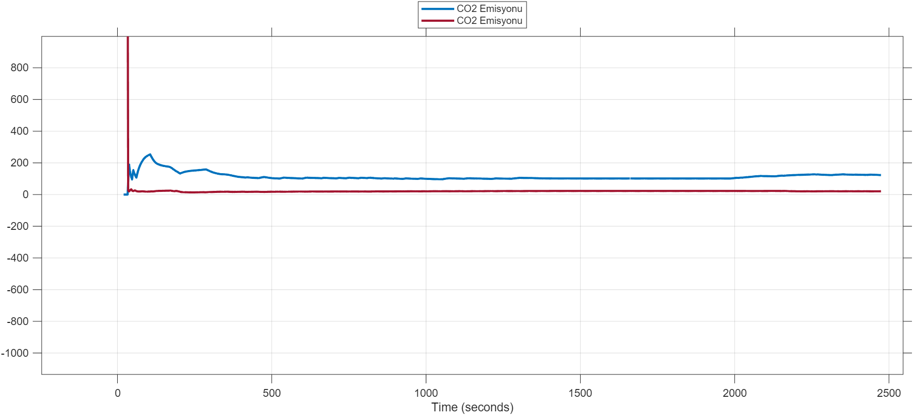

# Seri ve Paralel Hibrit (HEV) Topoloji Kıyaslaması ve Enerji Yönetimi

Bu proje, elektrikli ve hibrit araçların çalışma prensipleri üzerine geliştirilmiş; Matlab/Simulink ve Stateflow ortamında kurgulanan kural tabanlı enerji yönetim algoritmalarını içeren bir simülasyon çalışmasıdır.

## 🚀 Projenin Amacı ve Kapsamı
Seri ve paralel hibrit (HEV) araç mimarileri modellenerek, standart FTP-75 sürüş çevrimi altında test edilmiştir. Projenin temel odak noktası, farklı motor topolojilerinin (içten yanmalı motor ve elektrik motoru) güç paylaşım senaryolarını algoritmik olarak yönetmek ve sistemlerin yakıt tüketimi ile CO2 emisyonu üzerindeki etkilerini analiz etmektir.

## 🛠️ Kullanılan Teknolojiler
* **MATLAB / Simulink:** Araç dinamiği, batarya modelleri ve güç aktarım organlarının parametrik modellenmesi.
* **Stateflow (Durum Makineleri):** Enerji yönetim stratejilerinin (kural tabanlı kontrol algoritmalarının) kurgulanması.
* **Veri Analizi:** Simülasyon çıktılarının (SOC, Yakıt Tüketimi, Emisyon) görselleştirilmesi ve karşılaştırılması.

## ⚙️ Kontrol Stratejisi ve Algoritma Mimarisi
Sistem verimliliğini maksimize etmek için Stateflow üzerinde üç ana sürüş modu algoritmik olarak kurgulanmıştır:

1. **Sadece Elektrik Modu (EV Mode):** Düşük hızlarda veya batarya doluluk oranı (SOC) belirli bir eşiğin üzerindeyken (%59 Seri, %40 Paralel) aracın sadece elektrik motoruyla tahrik edilmesi.
2. **Hibrit Mod (Hybrid Mode):** Hızın veya tork talebinin arttığı durumlarda içten yanmalı motorun dinamik olarak devreye girip güç paylaşımına katılması (Paralel) veya jeneratör üzerinden bataryayı şarj etmesi (Seri).
3. **Rejenerasyon Modu:** Frenleme anlarında (Decel > 0) içten yanmalı motor torkunun anında sıfırlanarak, tekerleklerdeki yavaşlama momentinin ters elektrik akımına dönüştürülüp bataryaya geri kazanılması.

## 📊 Temel Çıktılar ve Sonuç
Simülasyon sonuçlarına göre, seçilen FTP-75 sürüş çevriminde **Paralel Hibrit** modelinin, içten yanmalı motorun mekanik gücünü doğrudan tekerleklere aktarabilme (doğrudan tahrik) yeteneği sayesinde enerji dönüşüm kayıplarını azalttığı; buna bağlı olarak kümülatif yakıt tüketiminde ve emisyon salınımında Seri Hibrit modele kıyasla daha yüksek verimlilik sağladığı gözlemlenmiştir.

> 📝 *Sistem parametreleri, aerodinamik kısıtlar ve matematiksel modellemelerin tüm detaylarını içeren kapsamlı proje raporuna repo içerisindeki PDF dosyasından ulaşabilirsiniz.*

## 📈 Örnek Çıktılar

FTP-75 sürüş çevrimi boyunca Seri ve Paralel modellerin karşılaştırmalı simülasyon sonuçları (kaynak: proje raporu, Şekil 5.1–5.3):

**Batarya SOC değişimi**

**Toplam eşdeğer yakıt tüketimi**

**Kümülatif CO₂ emisyon salınımı**

## English Summary

This project models and compares series and parallel hybrid-electric-vehicle (HEV) powertrain topologies in MATLAB/Simulink and Stateflow, using rule-based energy management strategies (EV-only, hybrid, and regenerative-braking modes) tested under the standard FTP-75 drive cycle. Results show the parallel hybrid model achieves lower cumulative fuel consumption and CO₂ emissions than the series model, due to its ability to transfer the internal combustion engine's mechanical power directly to the wheels rather than through a series electrical conversion chain. The full report (system parameters, aerodynamic assumptions, and mathematical modeling) is included as a PDF in this repository.
